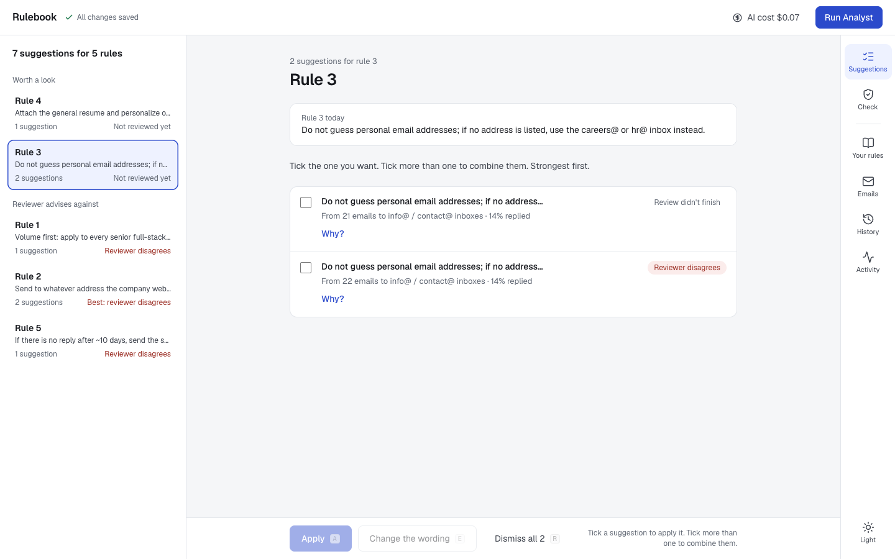
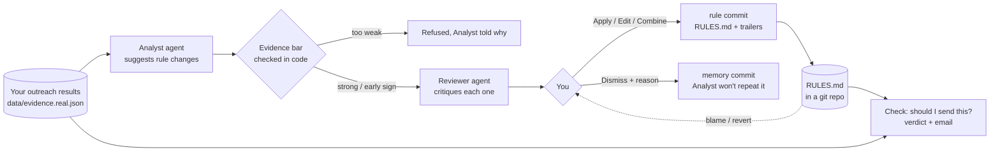
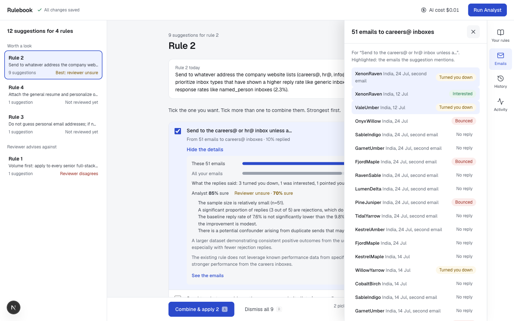
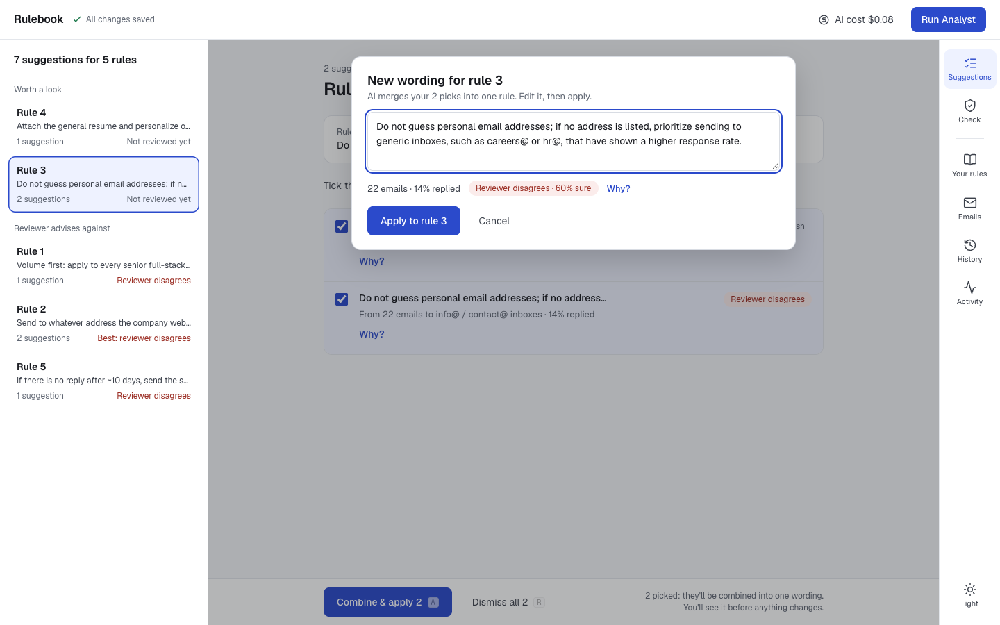
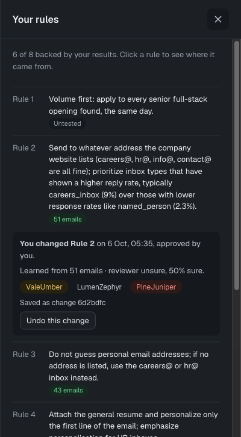
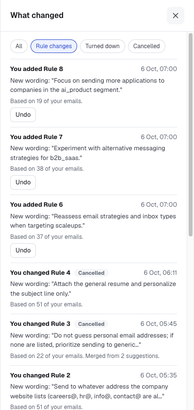
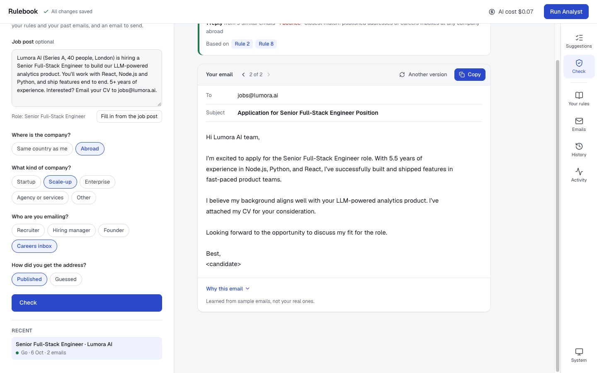
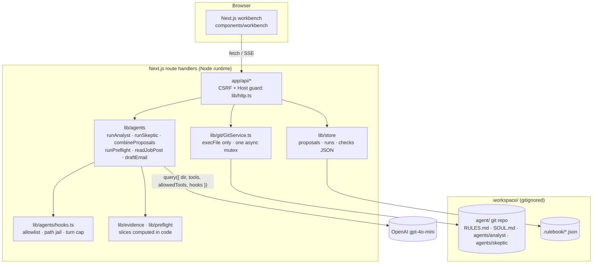
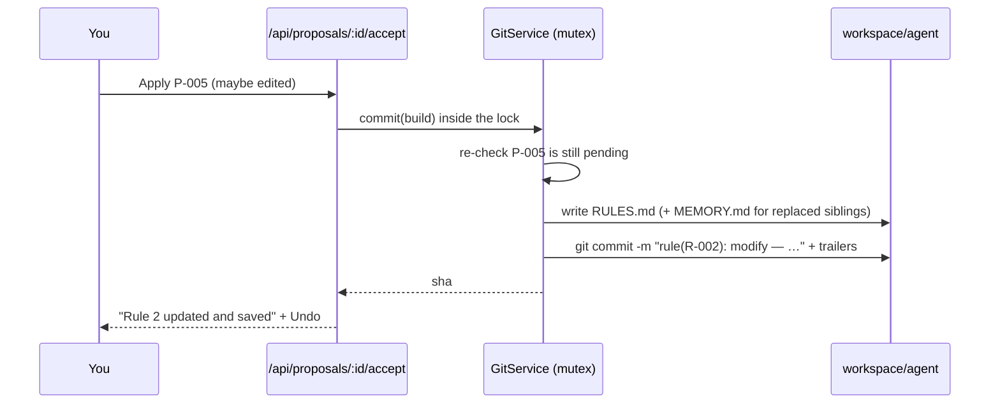

# Rulebook

**An outreach agent whose rulebook is learned from real outcomes, where every lesson is approved by a human and stored as a git commit.**

Built on [GitAgent](https://github.com/open-gitagent/gitagent) (`@open-gitagent/gitagent@2.2.0`) for the Lyzr AI PM assignment.



---

## The problem

Targeted cold outreach for a job is blind. You send an email and usually hear nothing. The lessons ("guessed addresses abroad never reply", "agencies don't answer") stay in your head, half remembered and never checked. Most tools push the other way: more volume, more automation.

**Who it's for:** a job seeker doing targeted cold outreach. The first user is me. The data in this repo is my own outreach from June–October 2026, anonymised: 137 sent emails, 11 human replies, 3 of them interested, and 11 bounces.

**Positioning:** quality over volume. **Rulebook never sends email.** It learns which approaches work, tells you whether to send the next one, and helps you write it. You decide everything.

## What it does

1. **Learns rules from your results.** An **Analyst** agent reads your outreach outcomes and suggests changes to your rulebook. It may also suggest nothing.
2. **Gets a second opinion.** A **Reviewer** (Skeptic) agent critiques each suggestion: sample size, confounders, rejections counted as replies.
3. **You decide.** You apply, edit, combine or dismiss each suggestion, one rule at a time. Applying writes `RULES.md` and commits it with evidence trailers. Dismissing saves your reason to the Analyst's memory, also as a commit.
4. **Every rule has provenance.** Click a rule to see the commit that wrote it, who approved it, the emails behind it, and **Undo** (`git revert`).
5. **Check before you send.** Describe a new target, or paste the job post. Code counts your similar past emails, and the agent gives **Go / Change / Skip / No rule**, citing your rules. It then writes the email from your rules and the emails that got replies.



## Quick start

Needs Node 20+ and an OpenAI key (the model is `gpt-4o-mini`).

```bash
git clone https://github.com/Henil1708/rulebook.git && cd rulebook
npm install
cp .env.example .env.local        # put OPENAI_API_KEY in it
npm run init:workspace            # or press "Set up your rulebook" in the app
npm run dev                       # http://localhost:3000
```

`init:workspace` copies `agent-template/` to `workspace/agent` and makes it a git repo with one commit, `init: rulebook v0 (July 2026 strategy)`. That repo is gitignored: the agent's commits never mix with this app's history.

```bash
npm test            # 216 tests (vitest)
npm run lint
npx tsc --noEmit
```

A full Analyst run costs about $0.005, a check about $0.0005, and writing an email about $0.001. The app shows the total against a budget (`RULEBOOK_BUDGET_USD`, default $5) and refuses new runs at the limit. Building and testing this whole project with real calls cost **$0.07 over 49 runs**.

## A tour

| | |
|---|---|
|  **Suggestions, one rule at a time.** Tick one to Apply. Tick several and the button becomes Combine & apply. |  **Why?** Reply rate against all your emails, what the replies said, how sure each agent is, and the emails behind it. |
|  **Combine & apply.** An AI draft of one wording, checked by the reviewer, editable before applying. |  **Where a rule came from.** git blame + trailers, evidence rows, Undo. |
|  **History.** The git log in plain words, with filters. |  **Should I send this?** Verdict, then an email to copy, with versions and saved checks. |

Also: light and dark themes (`06`), and a phone layout (`07`, `08`).

## Architecture



| Agent | Directory (gets its RULES.md + SOUL.md in the prompt) | Tools it may use | Turn cap |
|---|---|---|---|
| **Analyst** | `workspace/agent/agents/analyst` | `memory` (load only), `read_evidence`, `read_rulebook`, `propose_rule_change` | 10 |
| **Reviewer / Skeptic** | `workspace/agent/agents/skeptic` | `read_evidence`, `submit_critique` | 4 (6 for a combined suggestion) |
| **Root agent** (follows the outreach `RULES.md`) | `workspace/agent` | one submit tool per call: `submit_verdict`, `submit_answers`, `submit_email` (or none, to draft a combined wording) | 2–3 |

**The model never writes git, and never decides a number that matters.**
- Proposals, critiques and verdicts arrive through tools whose arguments are checked with zod and against the evidence.
- Slice counts (n, replies, bounces) are always recomputed by the server.
- Only the server commits.

## How git is used

| What you see | Git mechanism | Where |
|---|---|---|
| Your rules | `RULES.md` of a real gitagent agent, loaded into the system prompt by gitagent | `workspace/agent/RULES.md` |
| Applying a suggestion | One commit, `rule(R-006): add — …`, with **trailers**: `Proposal`, `Evidence`, `Slice`, `N`, `Metric`, `Proposed-By`, `Critique`, `Critique-Override`, `Edited-By`, `Combines`, `Replaces`, `Evidence-Level`, `Approved-By`, `Evidence-Source` | `lib/review.ts` (`acceptProposal`) |
| Other suggestions for the same rule closing as "replaced" | Same commit: `Replaces:` trailer, plus a line in the Analyst's memory file | `lib/review.ts` |
| Dismissing with a reason | A **memory commit** `memory(analyst): rejected P-012 — reason`, appending to the file the Analyst `load`s next run | `agents/analyst/memory/MEMORY.md`, `rejectProposals` |
| "Where did this rule come from?" | `git blame --line-porcelain RULES.md`, then that commit's trailers. If the line was restored by an undo, blame again at `<reverted>^` to find who really wrote it | `lib/workspace.ts` |
| History / timeline | `git log` parsed into plain words (subject + trailers), with filters | `lib/history.ts` |
| Undo | `git revert --no-edit <sha>`, a new commit; history is never rewritten. A conflicting revert is aborted (`git revert --abort`) and refused with 409 | `GitService.revert`, `undoChange` |
| "Your rules changed since this check" | Each saved check stores the `HEAD` sha it was based on | `lib/store/checks.ts` |
| Honest history | The app repo (this one) records how I built it; the agent's commits live in a **separate, gitignored repo** | `workspace/` |

A real rule commit from my workspace:

```
rule(R-003): modify — Do not guess personal email addresses; if no address is listed, use the careers@ or hr@ i…

Proposal: P-003
Evidence: ev-072, ev-056, ev-057, ev-062, ev-063, ev-135
Slice: inbox_type=named_person
N: 43
Metric: 1 human replies, 4 bounces
Proposed-By: analyst
Edited-By: operator
Approved-By: operator
Evidence-Source: gmail
```



**Not used, honestly:** branches for experiments (a stretch goal, not built), and `git worktree`. A temp worktree let an earlier version of M7 draft emails "as the rulebook was at commit X"; it was removed together with that feature (see Decisions).

## GitAgent findings

I read the installed package (`node_modules/@open-gitagent/gitagent/dist`, v2.2.0) and ran a spike before building ([`docs/spike-notes.md`](docs/spike-notes.md)). `gaps.md` in the gitagent repo was written against v2.1.0, and some of its gaps are fixed in 2.2.0.

| Finding | Evidence (v2.2.0) | Status | What Rulebook does |
|---|---|---|---|
| **Memory commit message goes through a shell string** (G27) | `dist/tools/memory.js:120`: ``execSync(`git add "${memoryPath}" && git commit -m "${commitMsg.replace(/"/g, '\\"')}"`)``. Only `"` is escaped; `$(…)` and backticks pass through | Open | The guard blocks `memory` `save` for every agent. The server writes memory itself through `execFile` (`GitService.appendMemory`, `rejectProposals`). The message sanitiser still runs as defence in depth (`lib/git/message.ts`) |
| **`memory` `save` overwrites the whole file** | Spike: it wiped the template's header. Saving unchanged content reports `git commit failed` but the run continues | By design | Agents may only `load`; the server appends |
| **`maxTurns` is not enforced** (G8–G10) | `dist/sdk.js:257-258` copies `options.maxTurns` into `modelOptions`, and the pi-agent-core engine ignores it. Spike: `maxTurns: 1` allowed 4 turns | Open | `createGuard` counts `assistant` messages and calls `abort()` at the cap, plus a 90 s wall-clock timeout (`lib/agents/hooks.ts`, `lib/agents/run.ts`) |
| **No filesystem jail on `read`** (G6) | `dist/tools/read.js:5-9` uses absolute paths as-is and `resolve(cwd, path)` otherwise. Spike: the model called `read ".."` and `read "../.."` | Open | No agent gets `read`/`cli`/`write`/`edit` (`allowedTools`). The guard also blocks them outright and rejects any path argument that resolves (realpath) outside the agent dir (`insideJail`, `lib/agents/hooks.ts:35`) |
| **Script hooks fail open** (G5) | `dist/hooks.js:87-90`: non-JSON output → `allow`. `dist/hooks.js:108-111`: a crashing hook is logged and execution continues | Open | Only **programmatic** SDK hooks are used. In `dist/sdk-hooks.js:21-23` a `block` throws, and a hook that throws propagates, so the call never runs (fails closed) |
| **Built-in tools ran in parallel** (G25) | `dist/tools/index.js:28` sets `executionMode = "sequential"` | Fixed in 2.2.0 | Our git writes and agent runs still share one workspace mutex (`withLock`) |
| **`abort()` was a no-op** (G8) | Spike: aborting ends the run with `stop=aborted` | Fixed in 2.2.0 | Used for Stop, the turn cap, the timeout, and a client leaving mid-stream |
| **Cost tracking** (G24) | `dist/cost-tracker.js` adds `usage.costUsd`; correct for OpenAI, $0 on custom endpoints | Works for us | `q.costs()` per run, saved to `runs.json`, shown against the budget |
| **LLM errors don't throw** | Spike: they arrive as `system error` + `assistant stop=error` | By design | The run status becomes `error`; the UI shows it |
| **Sub-agents inherit the parent's rules** | `dist/loader.js:142-143`: "Load parent RULES.md for appending (union)" | Read in source, not separately tested | Means the Analyst and Skeptic also see the outreach rulebook they reason about |

Model behaviour worth knowing, which is not a gitagent bug:
- **gpt-4o-mini invents a date window when given none.** It guessed 2023, found 0 rows and ran out of turns. Prompts now state the real date range and say "don't pass a window".
- **It sometimes writes the answer as text instead of calling the submit tool.** We retry once with a nudge.
- **It copied a prompt's example sentence verbatim into a verdict.** Examples were removed from that prompt.

## Decisions and cuts

| Decision | Why |
|---|---|
| **No sending, ever** | Quality over volume. The human sends. |
| **Two repos: app vs workspace** | The graded commit history must be honest. The agent's runtime commits would otherwise flood or fake it. |
| **The evidence bar is enforced in code, not asked for in the prompt** | A suggestion needs 10+ similar emails, a reply or bounce rate at least 5 points from your average, and 2+ real replies or bounces. One **interested** reply is enough for an early "worth trying" suggestion. The Analyst may suggest nothing; before this it was forced to suggest 1–3 every run, and the reviewer disagreed with most of them. |
| **"n < 10 can't be supported" is enforced in code** | The Skeptic's "support" on a small slice is downgraded to "unsure", and the override is shown. |
| **Decide once per rule** | Suggestions are grouped by the rule they change. Apply one, combine several (AI draft + re-review), or dismiss all with one reason. Others close as "replaced" in the same commit. |
| **No date filter** | Run Analyst always uses every result. Detecting "N new results since last run" was cut. |
| **Plain language, percentages, panels over the page** | Early designs were cluttered and full of jargon ("proposals", "slices", 0.8 confidence). The 1B design was chosen from clickable prototypes. |
| **M7: replaced the "draft at two commits" Drafter with a pre-flight check** | Drafting emails for companies I had already contacted wasn't useful. What a job seeker needs is: should I send *this* email, to a *new* company, and what should it say? |
| **Dropped the two-column before/after compare** | It came with the Drafter. The "rulebook learned" story is told through provenance, History and Undo instead. |
| **Pre-flight numbers come from code; the model only words the verdict** | Answers whose counts or rule IDs don't match the server are rejected (one retry). Below 5 similar emails we say "too few", not a guess. |
| **Sample email bodies, clearly labelled** | Real bodies weren't in the dataset. `data/email-bodies.synthetic.json` comes from a seeded script, and the outcome never shaped the text, so there is no fake signal. Real ones go in a gitignored `data/email-bodies.local.json`. |
| **Sample-data toggle removed from the screen** | The API still takes `synthetic`, but the UI focuses on real data. |

## What's broken and why

- **Which rule applies is still the model's call.** Code checks that cited rule IDs exist and that numbers match. It doesn't check that the most relevant rule was chosen. gpt-4o-mini once cited "attach your CV" as the reason to skip a company. The prompt now restricts the deciding rules, but there's no automated check.
- **With sample bodies, "learned from emails that got replies" is a demo, not a result.** Drafts are generic until real bodies are added.
- **The data can't tell a named recruiter from a hiring manager** (both are `named_person`). In the Check form, "Recruiter" therefore means the hr@ inbox, and "Founder" also matches named people.
- **Two old suggestions in my workspace have no review.** One predates the Skeptic; the other was killed by a since-fixed bug ("Controller is already closed" when the browser left mid-stream). There is no "review again" button.
- **History shows long rule wordings cut at about 90 characters**, because that's the commit subject. The full text is in Your rules.
- **The Activity step list lives in memory.** After a refresh you only see the last run's time and cost.
- **One workspace lock for everything.** An Analyst run blocks deciding and checking until it finishes. That's fine for one user and wrong for many.
- **M8 is not done.** "Replay history week by week" isn't built, and the synthetic `syn-trap` demo isn't wired into the UI.
- **Phones:** the bottom bar has 7 items, so labels are small.

## With a week I would…

- **Measure whether rules work after adoption.** Add "since adopted" stats per rule: emails sent under a rule vs before it, so a rule can earn or lose trust.
- **Run experiments on git branches.** Try a "worth trying" rule on `experiment/<name>` for the next 10 emails, compare, then merge (`--no-ff`) or discard.
- **Use real email bodies.** Export them from Gmail, anonymised, into `data/email-bodies.local.json`, so drafts learn my actual writing. Add a per-email "this got an interested reply" view.
- **Build an eval set for the verdict.** Write 30 hand-labelled targets, check that the cited rule is the relevant one, and track it per prompt change, instead of eyeballing.
- **Replay history** week by week (M8) so the rulebook visibly evolves from the July plan.
- **Review again** for suggestions that never got a review, and a persisted activity log.
- **Try Lyzr Studio** as the model provider, and host a demo with a persistent disk.

## Data provenance

See [`data/README.md`](data/README.md).

| File | What |
|---|---|
| `data/evidence.real.json` | 142 real outreach attempts from my Gmail (June–October 2026), **anonymised**: company pseudonyms, personal addresses removed, my name replaced. Outcomes were classified by hand. |
| `data/evidence.synthetic.json` | 45 made-up future events, labelled `source: synthetic`, including one deliberate trap row. |
| `data/email-bodies.synthetic.json` | 185 **sample** email bodies, seeded, carrying no signal. |
| `data/email-bodies.local.json` | Real bodies, if added. **Gitignored, never pushed.** |

Baseline from the real data: 137 dated sends, 11 human replies (8%), 11 bounces. Every slice is small, and the Reviewer is there to say so.

## Repo layout

```
app/                      Next.js App Router: page + route handlers (app/api/*)
components/workbench/     the UI: workbench, rule review, Check page, side panels, styles
lib/agents/               gitagent query() wrappers + guard (hooks.ts) + turn cap (run.ts)
lib/tools/                custom tools: read_evidence, read_rulebook, propose_rule_change, submit_critique
lib/git/                  GitService (execFile + mutex), trailers, message sanitiser
lib/evidence, lib/rules   pure functions: filtering, slice stats, RULES.md parse/apply
lib/preflight.ts          the Check: slice in code, relaxation, answer checks
lib/store/                proposals.json, runs.json, checks.json (working state; history is git)
agent-template/           the gitagent agent copied to workspace/agent
data/                     evidence + sample bodies (see data/README.md)
docs/                     spike notes, screenshots
```

## Out of scope

Sending email · job search or scraping · live Gmail sync · multiple users or auth.

## Hosted demo

There is a hosted demo on Railway, built from the `Dockerfile`. The workspace repo lives on a persistent volume at `/app/workspace`, so rules and their history survive restarts. `RULEBOOK_BUDGET_USD` is set low to cap AI spend. It is a shared, single-user demo: there is no login, and everyone who opens it sees and changes the same rulebook.
